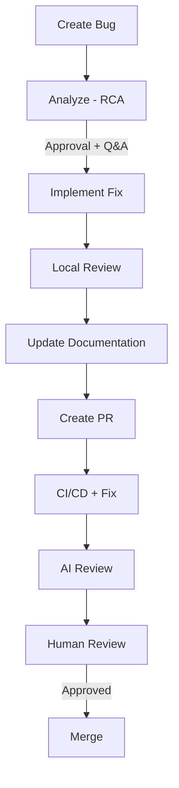

# Bug Workflow

Bugs follow a simpler workflow than features: one approval gate instead of four, then straight to implementation.

## Overview

## Triggering a Bug Workflow

Create a Jira issue with:

- **Issue type:** Bug
- **Label:** `forge:managed`

Forge detects the issue type and routes it through the bug pipeline instead of the feature pipeline.

## Stage Reference

### RCA Analysis

Forge analyzes the bug report and generates a root cause analysis. The RCA includes:

- Probable root cause
- Affected code areas
- Proposed fix approach

The RCA is posted as a comment on the Jira ticket.

**Human action:** Review the RCA. Optionally ask questions with `?` or `@forge ask`. Approve with `forge:plan-approved` to proceed to implementation.

---

### Implementation → PR → CI → Review

The remaining stages are identical to the [Feature Workflow](feature-workflow.md):

- Code implemented in an ephemeral Podman container
- Local code review before PR creation
- Fork-based PR created
- CI validation with automatic fix loop (up to 5 retries)
- AI review against the RCA
- Human review and merge

## Q&A Mode

Same as features — prefix your comment with `?` or `@forge ask` to ask questions without triggering regeneration.

## Key Differences from Feature Workflow

| | Feature | Bug |
|---|---|---|
| Planning stages | 4 (PRD → Spec → Epics → Tasks) | 1 (RCA) |
| Approval labels | `prd-approved`, `spec-approved`, `plan-approved`, `task-approved` | `plan-approved` |
| Implementation | Multi-task, multi-repo | Single fix pass |

## Labels

| Label | Purpose |
|-------|---------|
| `forge:managed` | Activate Forge for this bug |
| `forge:plan-pending` | RCA posted, awaiting approval |
| `forge:plan-approved` | RCA approved, proceed to implementation |
| `forge:blocked` | Workflow blocked |
| `forge:retry` | Resume from failed node |

See [Jira Labels](labels.md) for the full reference.
